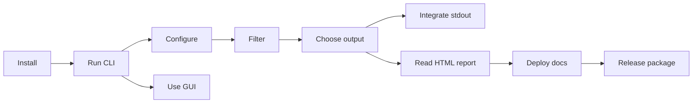

# LSW: List Walker

LSW (List Walker) is a Python command-line utility inspired by `ls` for walking directories and producing browsable trees, file inventories, and export files.

The public package is available on [PyPI](https://pypi.org/project/lsw-directory-walker/).

See the [GitHub Releases page](https://github.com/FinickySpider/lsw-directory-walker/releases) for version history. LSW uses the [MIT License](https://github.com/FinickySpider/lsw-directory-walker/blob/main/LICENSE); credit is appreciated but not required.

The MIT license permits commercial use and redistribution. Please do not present unchanged or minimally changed copies as original work or imply that unofficial distributions are official or endorsed.

This documentation describes the complete current behavior of the script, including its command-line interface, configuration files, filtering rules, output formats, interactive HTML report, and internal architecture.

## Start here

### Get started

- [Installation](installation.md): install the public PyPI package and configure first-run user settings.
- [CLI reference](cli.md): learn the installed `lsw` command and every argument.
- [Graphical launcher](gui.md): use the one-shot Flet interface.

### Scan and integrate

- [Configuration and presets](configuration.md): customize defaults and reusable profiles.
- [Filtering and traversal](filtering.md): understand include, ignore, size, date, and depth rules.
- [Output formats](outputs.md): choose HTML, TXT, CSV, JSON, JSONL, or Markdown.
- [stdout and stderr integration](streams.md): connect LSW to applications, AI tools, and pipelines.
- [HTML report guide](html-report.md): use search, grouping, analytics, copying, and printing.

### Maintain and publish

- [Developer reference](developer-reference.md): follow the execution flow and data contracts.
- [Documentation deployment](deployment.md): publish the Retype site with GitHub Pages.
- [Release guide](releasing.md): publish future versions to PyPI.

Use the guide in this order:



## Quick start

Install LSW from PyPI:

```powershell
py -m pip install lsw-directory-walker
```

For a source checkout, use `py -m pip install .` instead.

Then run it from any directory:

```powershell
lsw
lsw --gui
```

The package installs Flet with LSW. The plain `lsw` command remains CLI-first; the GUI is explicitly selected with `--gui`.

From the repository root:

```powershell
python lsw.py --path .
```

The default command creates `tree_output.html` and opens it in a browser. To create a plain-text tree instead:

```powershell
python lsw.py --path . --type txt --out tree.txt --no-browser
```

To build this documentation site locally, install Retype and run:

```powershell
retype start
```

To generate static files for deployment:

```powershell
retype build
```

Retype reads the Markdown files in `docs/` and writes the generated site to `.retype/`.

## Requirements

- Python 3.8 or newer is recommended for LSW.
- The package installs Flet as its GUI dependency.
- Retype is required only when building or previewing this documentation site.

## Current implementation notes

The documentation describes the code as it exists today. In particular, hidden entries are skipped, the parallel CLI settings are currently parsed but unused, `show_hidden` is not wired into scanning, and `--ext` does not affect the TXT output branch.
