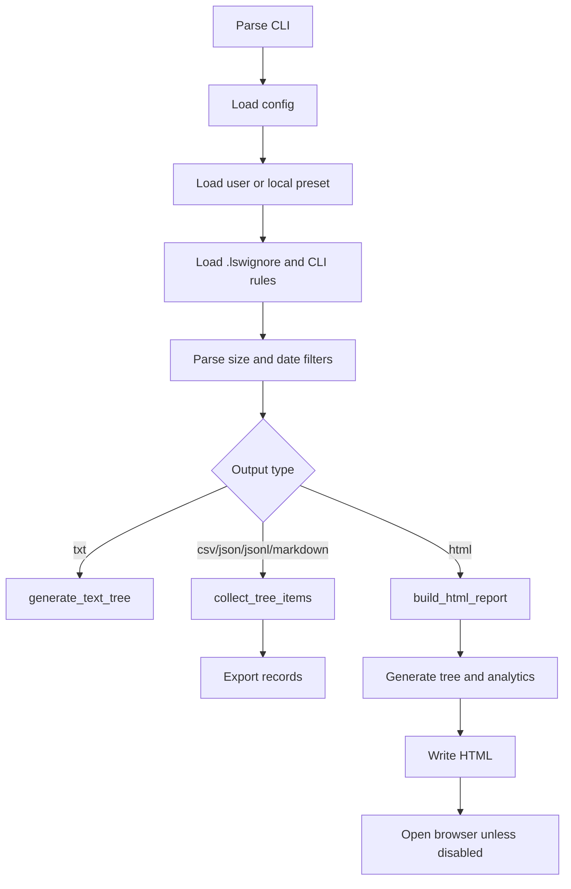

# Developer Reference

## Module responsibilities

`lsw.py` is intentionally self-contained and has no runtime package dependencies.

| Area | Main functions | Responsibility |
|---|---|---|
| Console | `safe_print` | Print messages while tolerating console encoding problems. |
| Icons | `get_mime_icon` | Map extensions and directories to Unicode icons. |
| Config | `load_config` | Merge built-in defaults with `lsw-config.json`. |
| Presets | `load_preset`, `get_available_presets` | Read named preset JSON files. |
| Rules | `load_lswignore`, `should_ignore`, `should_include` | Load and evaluate ignore/include rules. |
| Scalar filters | `parse_size`, `parse_date`, `should_include_by_size`, `should_include_by_date` | Convert CLI values and test file metadata. |
| Sizing | `get_folder_size`, `human_size`, `clear_size_cache` | Calculate and format sizes. |
| Tree generation | `generate_text_tree`, `generate_html_tree` | Render recursive tree output. |
| Inventory | `collect_tree_items` | Build flat metadata records for exports and analytics. |
| Exports | `export_csv`, `export_json`, `export_jsonl`, `export_markdown` | Serialize inventory records. |
| Analytics | `generate_analytics_data` | Compute KPIs, top files, type totals, and a treemap. |
| HTML assembly | `build_html_report` | Combine filtered tree and analytics into one page. |

## Execution flow

## Inventory record contract

`collect_tree_items` returns dictionaries with `path`, `name`, `type`, `size`, `mtime`, and `mtime_str`. `type` is either `file` or `dir`. This record is the contract consumed by all structured exporters and by `generate_analytics_data`.

## Size cache

`get_folder_size` stores results in the module-level `_size_cache`, keyed only by path. The cache is not keyed by ignore rules or depth. A long-running caller that changes those arguments should call `clear_size_cache()` before recalculating.

## Error-handling style

Filesystem access catches `OSError` and `PermissionError` in traversal and metadata paths. Most unreadable entries are skipped. Configuration and CLI validation errors are surfaced to the user and terminate the command.

## Maintenance notes

- `ThreadPoolExecutor`, `mimetypes`, `guess_extension`, `types_map`, and `sys` are imported but unused.
- The parallel CLI flags do not currently alter traversal.
- `show_hidden` and the config `theme` value are not wired into output generation.
- HTML folder sizes use `get_folder_size`, while analytics treemap sizes are independently recomputed.
- The mutable default `count=[0]` in `generate_html_tree` is shared across calls. Passing an explicit list is safer for repeated programmatic use.
- The HTML `is_last` calculation uses the unfiltered directory listing, so connectors can look visually inconsistent when entries are skipped by filters.

These notes describe the current implementation and are useful targets for future tests or refactoring; they are not required for normal CLI use.
