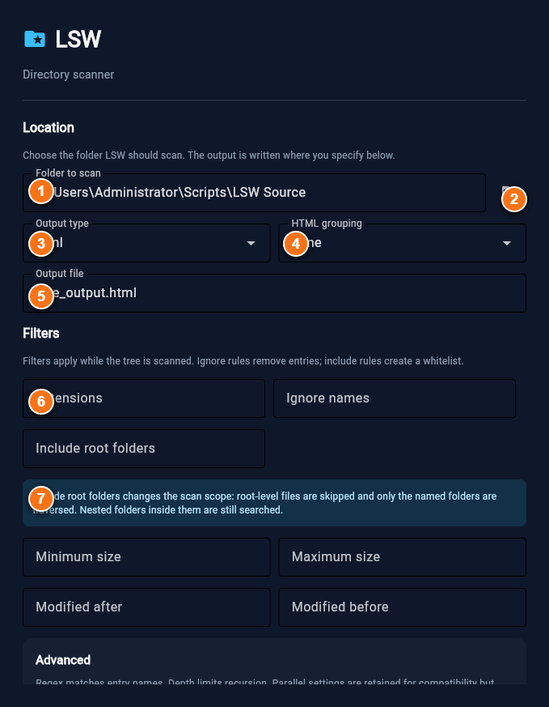
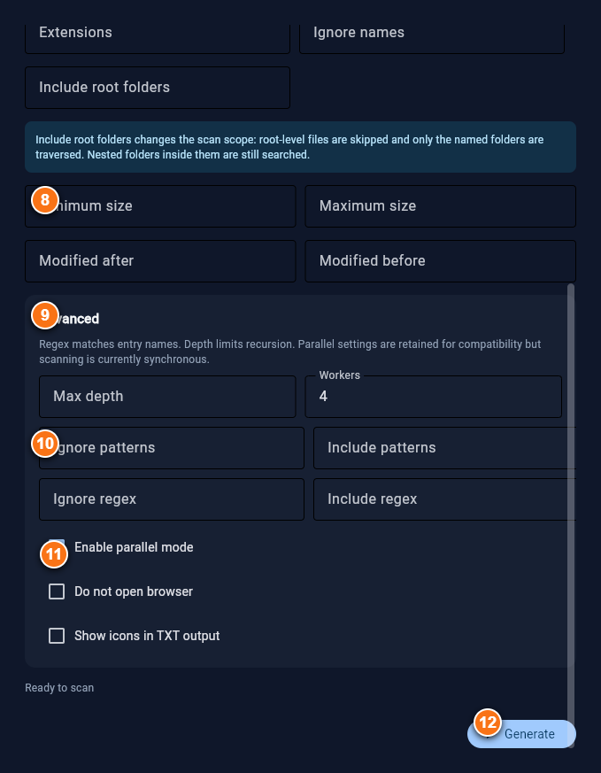

# Graphical Launcher

LSW includes an optional one-shot graphical launcher built with Flet. It is designed for quickly choosing scan settings, generating one report, and closing rather than running as a permanent dashboard.

The launcher is vertically scrollable. The annotated captures below pair each part of the form with its legend so you can read the labels without scrolling back and forth. On narrow screens, Retype stacks each pair vertically.

||| Main settings

||| Main settings legend
| Marker | UI area | Purpose |
|---:|---|---|
| 1 | Folder field | The directory LSW scans. |
| 2 | Folder picker | Opens the native directory chooser. |
| 3 | Output type | Selects HTML, TXT, CSV, JSON, JSONL, or Markdown. |
| 4 | HTML grouping | Groups an HTML report by type or filename prefix. |
| 5 | Output file | Destination filename; the correct extension is added when needed. |
| 6 | Filter fields | Extensions, ignore names, include roots, size limits, and date limits. |
| 7 | Include explanation | Reminds you that include roots change the scan scope. |
|||

||| Advanced settings legend
| Marker | UI area | Purpose |
|---:|---|---|
| 8 | Advanced panel | Less-common filters and execution settings. |
| 9 | Depth and workers | Limits traversal depth and sets the retained worker count. |
| 10 | Pattern and regex fields | Adds glob or regular-expression include/ignore rules. |
| 11 | Behavior toggles | Browser opening, TXT icons, and parallel-mode compatibility settings. |
| 12 | Generate | Starts the scan; controls lock and progress appears while it runs. |
||| Advanced settings

|||

## Start the launcher

When installing from a package, Flet is installed automatically. For a local checkout, install LSW with:

```powershell
py -m pip install .
```

Then run:

```powershell
lsw --gui
```

The normal command-line interface remains available as `lsw`. The package includes Flet so the GUI is ready immediately.

On first run, LSW also creates editable user defaults, presets, and `.lswignore` under `%APPDATA%\\lsw` on Windows. Existing files are never overwritten.

## Workflow

1. Choose the folder to scan with the folder button.
2. Select an output type and, for HTML, an optional grouping mode.
3. Set the output filename.
4. Add filters if needed.
5. Expand the Advanced section for regex, depth, worker, and behavior settings.
6. Click **Generate**.
7. LSW disables the form, scans in a background thread, and shows a progress bar while generation runs.
8. After a successful export, the window displays the saved path briefly and closes automatically.

If validation or generation fails, the window stays open, re-enables the controls, and shows the error so you can correct it.

## Main controls

| Area | Controls | Behavior |
|---|---|---|
| Location | Folder field and folder picker | Selects the directory passed to the scanner. |
| Output type | HTML, TXT, CSV, JSON, JSONL, Markdown | Selects the same output branches as the CLI. |
| HTML grouping | None, file type, prefix | Applies only to HTML reports. |
| Output file | Filename field | The appropriate extension is added when needed. |
| Filters | Extensions, ignore names, include root folders, size limits, date limits | Applies the same scan filters as the CLI. |
| Advanced | Depth, workers, glob patterns, regexes | Exposes less common filters and options. |
| Behavior | No browser, TXT icons, parallel mode | Controls browser opening and TXT presentation. Parallel options are currently retained for compatibility; scanning is synchronous. |

## Important include behavior

The **Include root folders** field is not a simple filename filter. When it has a value, LSW changes the scan scope:

- Root-level files are skipped.
- Only the named directories directly below the selected folder are traversed.
- Nested directories inside those selected roots continue to be searched.
- Use **Include patterns** or **Include regex** when you want to whitelist file names instead.

For example, with a selected folder containing `src`, `tests`, `docs`, and `README.md`, entering `src,tests` scans only `src` and `tests`; it does not include the root `README.md` or `docs`.

## Standalone HTML reports

When the output type is HTML, the generated report is a snapshot. The report embeds its tree, metadata, analytics data, and chart rendering code. It does not need LSW, Python, Flet, the original folder, or a network connection after generation.

You can move, rename, copy, or send the HTML file independently. The paths shown in the report remain the paths captured at generation time, so a copied path may not exist on the recipient's computer even though the report itself continues to work.

## Dependency note

Flet is optional. CLI users can continue using:

```powershell
python lsw.py --path . --type json
```

without installing the GUI dependency.
