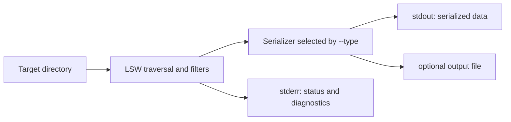

# stdout and stderr Integration

LSW can be used as a library-like command-line component inside another application. The recommended integration mode is `--stdout-only`, which returns the serialized result through stdout without creating a file.

## Three output modes

### File only

```powershell
lsw --path . --type json --out inventory.json
```

LSW writes the file and does not print the serialized data.

### stdout and file

```powershell
lsw --path . --type json --stdout --out inventory.json
```

LSW writes the file and prints the same serialized representation to stdout. This is useful when a human wants a saved artifact while a parent process also consumes the result.

### stdout only

```powershell
lsw --path . --type json --stdout-only
```

LSW prints the serialized representation and does not create an output file. This is usually the best mode for AI tools, editors, subprocesses, shell pipelines, and temporary analysis.

## Data flow



The streams have separate jobs:

| Stream | Contains | How applications should use it |
|---|---|---|
| stdout | The selected serialized output | Parse or consume it as the result. |
| stderr | Status messages, validation errors, and diagnostics | Log it, display it, or inspect it when the process fails. |
| output file | The same serialized output when file saving is enabled | Keep it as an artifact or open it later. |

When `--stdout` or `--stdout-only` is active, status text is kept off stdout so it cannot corrupt JSON, CSV, JSONL, or other machine-readable output.

## Supported formats

Both stream modes support every LSW output type:

| Type | stdout content | Typical consumer |
|---|---|---|
| `html` | Complete standalone HTML document | Browser, archive, report viewer |
| `txt` | Unicode directory tree | Terminal, log, text-processing tool |
| `csv` | Header row followed by CSV records | Spreadsheet, ETL, data-processing code |
| `json` | One complete JSON array of inventory records | Python, JavaScript, AI tooling, APIs |
| `jsonl` | One JSON object per line | Streaming processors, indexes, log pipelines |
| `markdown` | Markdown heading and inventory table | Documentation, code review, notes |

## JSON from Python

```python
import json
import subprocess

result = subprocess.run(
    [
        "lsw",
        "--path", folder,
        "--type", "json",
        "--stdout-only",
        "--ignore", "node_modules,.venv",
    ],
    capture_output=True,
    text=True,
    check=True,
)

items = json.loads(result.stdout)
for item in items:
    print(item["path"])

if result.stderr:
    print("LSW diagnostics:", result.stderr)
```

Each JSON item contains fields such as:

```json
{
  "path": "C:/project/src/main.py",
  "name": "main.py",
  "type": "file",
  "size": 1234,
  "mtime": 1760000000.0,
  "mtime_str": "2025-10-09 12:00:00"
}
```

## JSON from PowerShell

```powershell
$items = lsw --path . --type json --stdout-only | ConvertFrom-Json
$items | Where-Object { $_.type -eq "file" } | Select-Object path, size
```

## JSONL streaming

```powershell
lsw --path . --type jsonl --stdout-only | ForEach-Object {
    $_ | ConvertFrom-Json
}
```

JSONL is useful when a consumer wants to process records one at a time instead of loading one large JSON array.

## Shell pipelines

```powershell
lsw --path . --type txt --stdout-only | Select-String "\.py$"
lsw --path . --type json --stdout-only | Set-Content inventory.json
lsw --path . --type csv --stdout-only | ConvertFrom-Csv | Where-Object type -eq file
```

For a pure data pipeline, prefer `--stdout-only` so no temporary report file is created.

## Error handling

Use the process exit code and stderr together:

```python
result = subprocess.run(
    ["lsw", "--type", "json", "--stdout-only", "--modified-after", "not-a-date"],
    capture_output=True,
    text=True,
)

if result.returncode != 0:
    raise RuntimeError(result.stderr)
```

A successful command returns exit code `0`. Invalid dates, invalid regular expressions, missing presets, and other validation failures return a nonzero exit code and write a diagnostic to stderr.

## Encoding and unusual paths

Stream output uses UTF-8 handling so Unicode names and HTML tree connectors do not crash Windows legacy consoles. Applications should capture stdout as text using UTF-8-capable settings when they need to preserve non-ASCII filenames.

LSW HTML output escapes special characters in embedded path attributes. Filesystem rules still apply: Windows cannot create some filenames that Unix permits, such as names containing quotes, reserved characters, or newlines.
